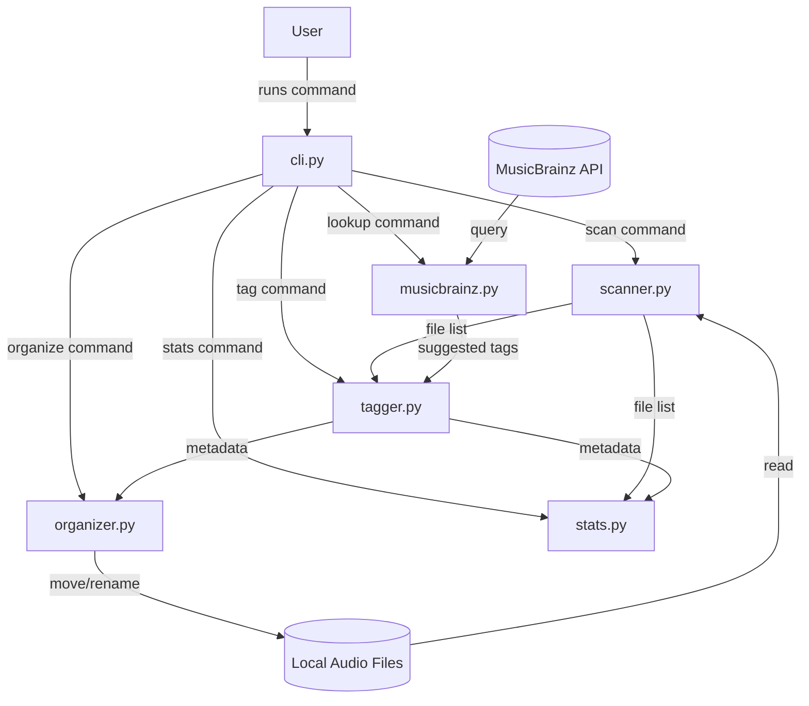
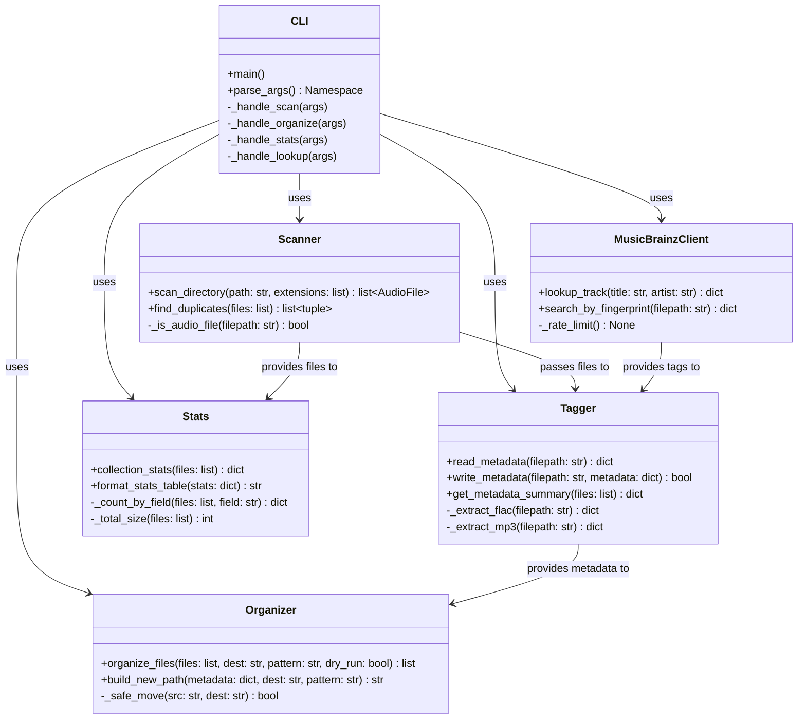
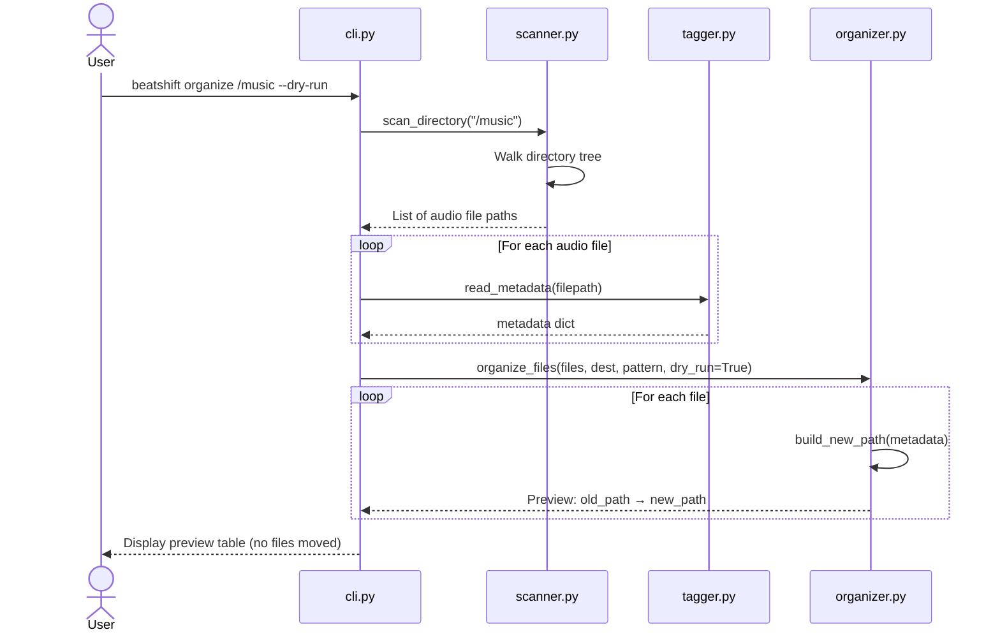
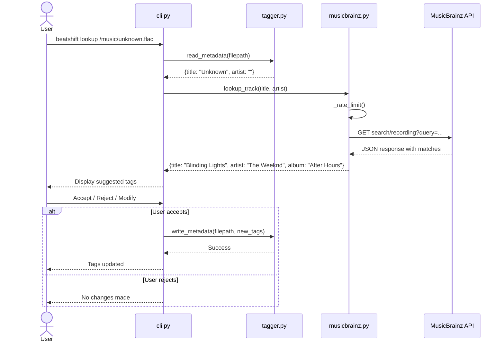
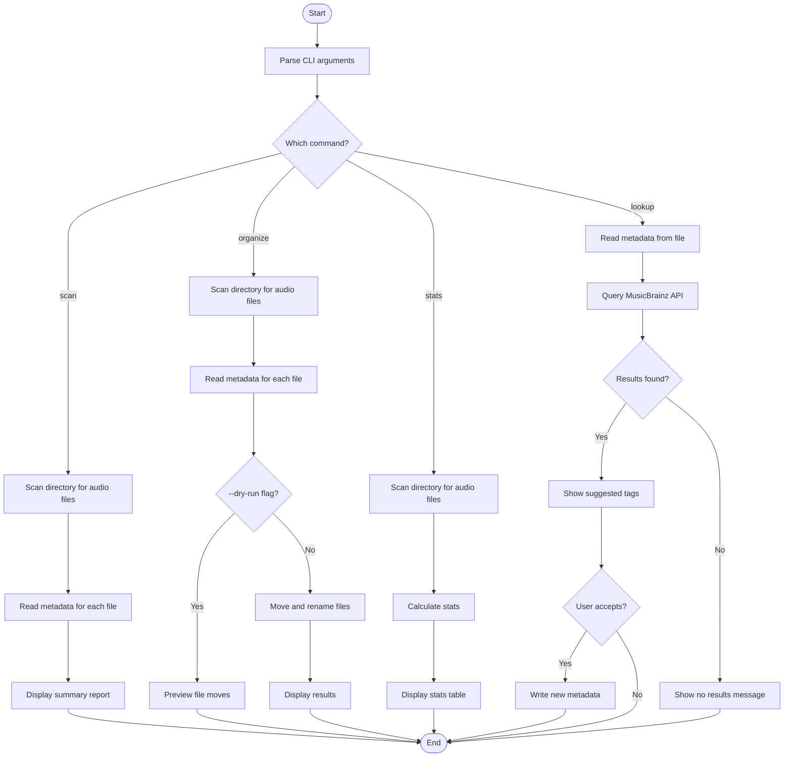

# System Modelling — beatshift

## 1. Architecture

beatshift uses a modular design where each job (scanning, reading tags,
organising files, showing stats) is handled by its own module.
Each module can be built and tested on its own, which fits the incremental development plan.
If I want to add a new feature later, I just add a new module without touching the existing ones.
Bugs are easier to track down when each file has one job.

---

## 2. Component Diagram

High-level view of how the parts connect.

---

## 3. Class Diagram

Shows what functions each module has and how they depend on each other.

---

## 4. Sequence Diagram — Scan and Organise

What happens when someone runs `beatshift organize /music --dry-run`.

---

## 5. Sequence Diagram — MusicBrainz Lookup

What happens when someone runs `beatshift lookup /music/unknown.flac`.

---

## 6. Activity Diagram — Main Flow

Overall flowchart of what the app does depending on the command.

---

## 7. Design Decisions

| Decision                    | Why                                                                                                                      |
| --------------------------- | ------------------------------------------------------------------------------------------------------------------------ |
| Modular architecture        | Each module does one thing. Easier to test, easier to debug, fits incremental development.                               |
| mutagen for metadata        | Handles both FLAC and MP3 through one library. Well documented, widely used.                                             |
| MusicBrainz over other APIs | Free, no API key needed, open source. Fits the assignment constraint of no costs.                                        |
| rich for terminal output    | Gives colour and tables with very little code. Makes the output actually readable.                                       |
| Configurable folder pattern | Users might want different structures. Using `{artist}/{album}/{track} - {title}` as default but letting them change it. |
| Dry-run as a safety feature | Moving files is permanent. Letting users preview first prevents accidents. Directly tied to NFR-03.                      |
